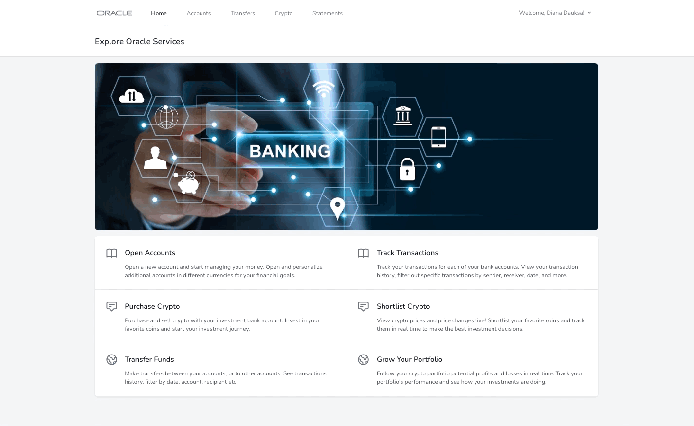
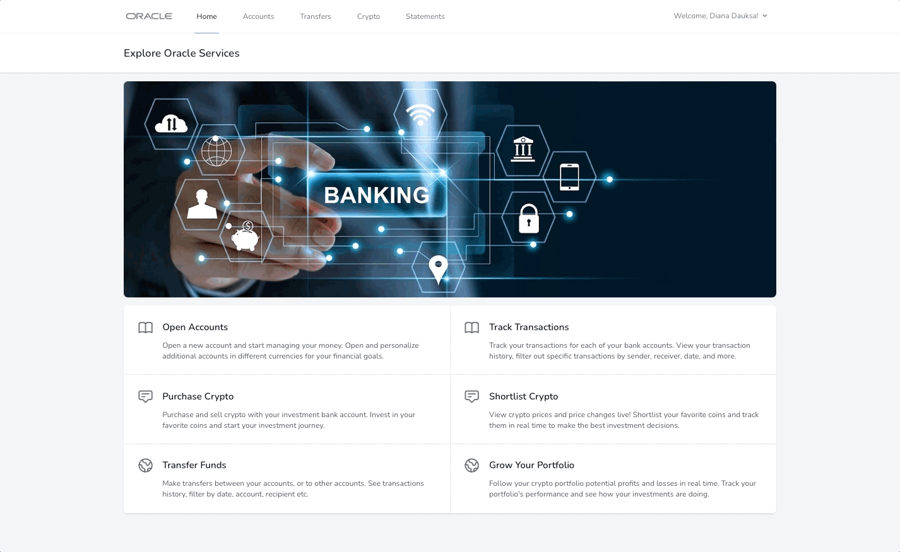

# "Oracle Banking" Online Banking Platform 

## Description
Oracle Banking is an online banking system built with PHP framework Laravel, complete with the necessary features such as:
* user account creation, login and individually issued security code card for further activities within the platform
* account management (opening, renaming and deleting different accounts in different available currencies)
* internal and external transfers (internal, i.e. to user's other created accounts, can be performed without providing a password and security code, external, i.e. to other users, can be performed only after providing a password and specific code from the issued security code card)
* currency exchange in cases when recipient's bank account is in a different currency, e.g. transfer made from EUR account to USD account
* account statement history and filtering by account, sender, recipient and date
* single transaction details
* ability to track real time price changes, buy, sell and shortlist crypto coins
* manage crypto coin portfolio, track and filter crypto coin transactions by coin, date and transaction type

## Technologies Used
* PHP 8.0
* [Laravel](https://laravel.com/docs/9.x) 9.0
* [MySQL](https://www.mysql.com) 8.0
* [Composer](https://getcomposer.org) 2.4
* [Tailwind CSS for styling](https://tailwindcss.com) 3.2
* [Node.js and npm](https://nodejs.org/en/download/) 18.13 and 8.19 respectively

## Setup
#### To setup and use the Oracle Banking Platform, follow these steps:
###### PREREQUISITES: Make sure that PHP (v8.0), Laravel (v9.1), MySQL (v8.0), Composer (v2.4), Node.js (v.18.13) and NPM (v8.19) (usually Node.js and npm come together in the package) are installed on the system.
1. Clone this repository using the following command in the terminal: `git clone https://github.com/dianadauksa/internet-banking`
2. Install the required PHP packages and dependencies by running this command in your project's terminal: `composer install`
3. Install the required JavaScript dependencies with command: `npm install`
4. Build the front-end assets by running command: `npm run dev`
5. Copy the `.env.example` and rename the copied file to `.env`
6. Register at [CoinMarketCap API](https://coinmarketcap.com/api/) and generate a free API key for the crypto coin data required within the project.
7. Input the generated API key in the `.env` file under `COINMARKETCAP_API_KEY`.
8. Create a database to be used for the project (see [Database Setup](#database-setup) for instructions).
10. Run the project from your local server using the command: `php artisan serve`
11. Open the generated link in your chosen web browser and start using the platform.

## Database Setup
###### PREREQUISITES: Make sure that MySQL is installed on the system and that the user has the necessary permissions to create and modify databases.
1. Use the MySQL command-line client to connect to the MySQL server with command: `mysql -u <username> -p`.
Enter the MySQL password at the prompt and press Enter. This will connect you to the MySQL server.
2. Create the database with command: `CREATE DATABASE <database_name>`.
Replace `<database_name>` with the name of the database that you want to create.
3. Connection configuration in the Oracle Banking project: enter database credentials (`DB_NAME`, `DB_USERNAME`, `DB_PASSWORD`) in the `.env` file.
4. Run `php artisan migrate` to create the necessary tables for the project.
5. Populate the database with data (optional). This can be done manually or simply by interacting with the website (e.g., creating new account, transfering money, buying/selling crypto coins etc.).

## Preview of Main Features

#### Welcome Dashboard, User Profile and User's Individual Security Code Card:

#### Bank Account Section, Opening, Renaming and Deleting an Account:

#### Transfers Section, Transfer to User's Own Account (no password and security code asked), Transfer to Another User's Account (password and security code asked):

#### Statements Section, Track Statements for Each Account, Filter by Account, Sender, Recipient, Date, View Single Transaction Data:

#### Crypto Coin Section, Open a Crypto Investment Account, View Most Popular Crypto Coins, Price Changes, Buy, Sell, Shortlist Crypto Coins:

#### User's Crypto Coin Portfolio, Tracking of Owned Crypto Coins and Shortlisted Crypto Coins, Crypto Activity Statements, Filtering by Coin, Date, Transaction Type:

